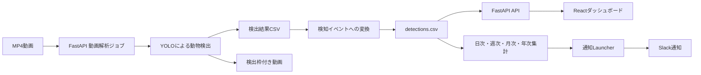
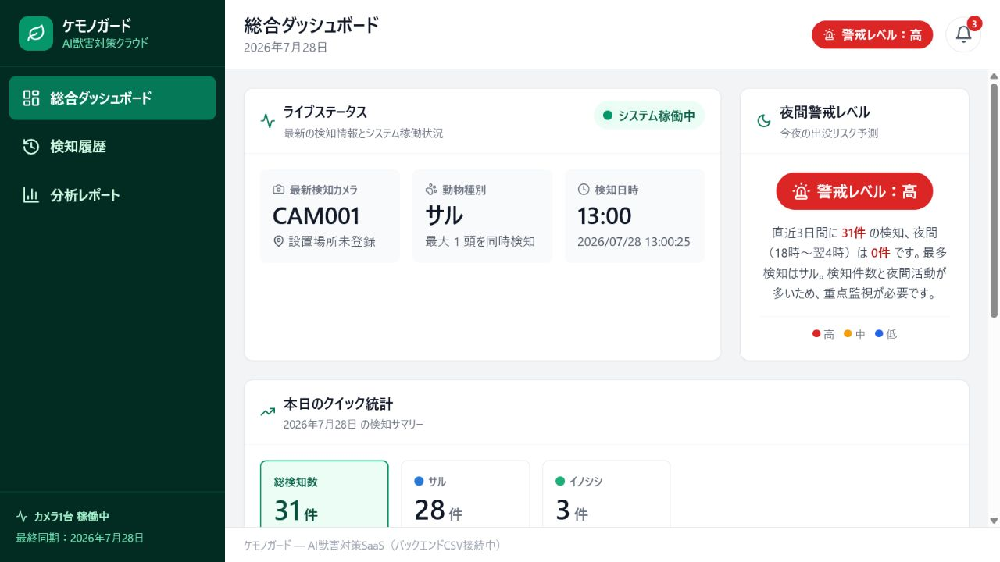

# businessAIsystem-nagoya-teamA

## 野生動物検知・分析システム

YOLOを用いて動画内のイノシシとサルを検出し、検知履歴の集計・可視化・通知を行う、4人チームで開発したWebシステムです。

## プロジェクト概要

野生動物による農作物被害などを想定し、カメラ映像から動物の出没を検知して、ダッシュボード上で確認できるシステムを構築しました。

主な流れは次のとおりです。



## 主な機能

- MP4動画を対象にしたYOLO推論
- 検出枠付き動画、検出CSV、フレーム集計CSV、解析JSONの生成
- `boar` / `monkey` の検出結果を `イノシシ` / `サル` の検知イベントへ変換
- `src/backend/detections.csv` を中心にしたデータ分析処理
- FastAPIによる検知履歴、出没ピーク、慣れ度、罠設置推奨スコアの提供
- React + Vite による簡易ダッシュボード
- 動画解析ジョブの登録、進行状況確認、結果反映
- `detections.csv` 更新を起点にした日次・週次・月次・年次集計
- 通知Launcherを経由したSlack通知処理

## デモ画面

### 分析ダッシュボード



### 動物検出結果

#### イノシシ動画で確認された誤検出


イノシシが映っている動画に対して推論を行いましたが、今回の条件では `boar` として検出されず、一部のフレームで `monkey` として誤検出されました。

この結果は、モデルの汎化性能に課題が残っていることを示しています。

#### サル動画で確認された検出


サル動画では複数個体を `monkey` として検出しました。使用した動画はバーバリーマカクの公開ライセンス素材であり、日本国内のニホンザルを用いた実環境検証ではありません。

## 技術スタック

| 領域 | 使用技術 |
|---|---|
| AI / 動画解析 | Ultralytics YOLO, OpenCV |
| バックエンド | Python, FastAPI, pandas |
| フロントエンド | React, Vite, Recharts, Tailwind CSS |
| 通知 | Slack Incoming Webhook |
| データ保存 | CSV, Excel |
| テスト | pytest, Vitest, Playwright |

## 開発体制と担当範囲

- 開発人数：4人
- 開発期間：2026年6月～7月
- 開発形式：大学でのチーム開発

### 安藤洸太朗の担当

- YOLOモデルの学習と評価
- MP4動画を対象とした動物検出処理
- 検出結果CSVの生成
- フレーム単位の検出結果を検知イベント形式へ変換する処理
- FastAPIへの動画解析機能の統合
- ReactフロントエンドとFastAPIバックエンドの接続
- 動画解析結果を既存の集計・通知処理へ統合
- `detections.csv` 更新から通知Launcher、Slack送信へつながる流れの確認

## システム構成

```text
project-root/
├── frontend/                       # React + Vite フロントエンド
├── src/
│   ├── backend/                    # FastAPI、分析API、集計CSV出力
│   ├── inputs/                     # ローカル入力動画など。現状はGit管理対象外
│   ├── notification/               # 通知用Excel更新、Slack通知、Launcher
│   ├── outputs/
│   │   ├── training/animal_demo/   # YOLOモデル。best.ptのみGit管理
│   │   └── video_analysis/         # 動画解析結果。Git管理対象外
│   └── scripts/                    # 動画解析、検出結果マージ、学習補助
├── tests/                          # Python側テスト
├── assets/readme/                  # README掲載用画像
└── README.md
```

## YOLOモデル

実装コードでは、既定モデルとして次のファイルを参照します。

```text
src/outputs/training/animal_demo/weights/best.pt
```

参照元は次のPythonファイルです。

- `src/scripts/analyze_video.py`
- `src/backend/api.py`

`analyze_video.py` のCLIでは `--model` 引数でモデルパスを指定できます。ただし、FastAPIの通常実行では上記の `MODEL_PATH` を使用します。

実装コードを変更せずにモデルを差し替えるため、提供された新しいYOLOモデルを既存パスの `best.pt` として配置しています。ファイル名と配置場所は維持しています。

| 項目 | 旧モデル | 新モデル |
|---|---|---|
| リポジトリ内パス | `src/outputs/training/animal_demo/weights/best.pt` | `src/outputs/training/animal_demo/weights/best.pt` |
| ファイルサイズ | 5,423,450 bytes | 19,165,914 bytes |
| クラス数 | 2 | 2 |
| クラスID | `0: boar`, `1: monkey` | `0: boar`, `1: monkey` |

新モデルはUltralytics YOLOの `DetectionModel` として読み込み確認済みです。FastAPI側の `MODEL_PATH` からも同じモデルを読み込めることを確認しています。

## モデル評価・動作検証

### 使用した公開動画

利用条件を確認できる公開ライセンス動画を使って、差し替え後モデルの推論を検証しました。

| 用途 | 動画 | 配布元 | ライセンス |
|---|---|---|---|
| イノシシ確認 | [Wild Boars Foraging in Natural Habitat Outdoors](https://www.pexels.com/video/wild-boars-foraging-in-natural-habitat-outdoors-28583161/) | Pexels | [Pexels License](https://www.pexels.com/license/) |
| サル確認 | [Barbary Macaque, Monkey, Barbary](https://pixabay.com/videos/barbary-macaque-monkey-barbary-2262/) | Pixabay / InspiredImages | [Pixabay Content License](https://pixabay.com/service/terms/#license) |

イノシシ動画は公開ライセンス素材であり、実際の農地や監視カメラで撮影した映像ではありません。

サル動画に映っている動物はバーバリーマカクです。汎用的な `monkey` クラスの動作確認に使用しており、ニホンザルや日本国内の実環境で検証した結果ではありません。

推論条件は次のとおりです。実装コード内の既定値は変更していません。

| 項目 | 値 |
|---|---:|
| confidence | 0.25 |
| image_size | 320 |
| device | cpu |
| tracker | bytetrack.yaml |

### 公開動画による動作検証

| 対象動画 | 正解クラス | 検出結果 | 備考 |
|---|---|---|---|
| イノシシ動画 | `boar` | `boar` 検出0件、`monkey` 誤検出16件 | 検出失敗。総フレーム957、検出あり15フレーム |
| サル動画 | `monkey` | `monkey` 検出1,710件、平均信頼度0.6613、最大信頼度0.8798 | 公開ライセンス動画で検証。処理フレーム406、検出あり406フレーム |

検出結果は手作業で修正していません。イノシシ動画では `boar` 検出に失敗し、`monkey` として誤検出されたため、今後の追加学習・データセット見直しが必要です。

### 定量評価について

新しいモデルについて、検証用データセット全体を使用したPrecision、Recall、mAP50、mAP50-95の再評価は未実施です。

現在の掲載結果は、公開ライセンス動画を使用した動作検証であり、モデル全体の定量評価を示すものではありません。旧モデルの評価値は、新モデルの結果と混同しないようREADMEには掲載していません。

### イノシシ動画で検出に失敗した想定原因

次の内容は、コード、学習条件、検証動画の特性から考えられる可能性であり、今後の検証が必要です。

- 学習データと公開検証動画で、撮影角度や背景が異なる可能性がある
- 学習データに含まれるイノシシの姿勢、距離、写り方に偏りがある可能性がある
- 検証動画内で動物の一部が草木や体勢によって隠れている可能性がある
- 縦長の高解像度動画を `imgsz=320` に縮小して推論した影響がある可能性がある
- イノシシとサルで学習データ数や画像の多様性に差がある可能性がある
- 類似した色、輪郭、局所的な特徴を誤って参照した可能性がある
- 新モデルの学習データと公開動画のドメインが異なる可能性がある
- `confidence=0.25` のしきい値設定により、低信頼度の誤検出が残った可能性がある
- 過学習または学習不足の可能性がある

### 次回の改善アプローチ

今回の結果を踏まえ、次回は次の観点で改善を進める方針です。

- 旧モデルと新モデルを同じ動画で比較する
- `imgsz=320` と `imgsz=640` で結果を比較する
- 信頼度しきい値を複数条件で比較する
- イノシシの撮影角度、距離、背景が異なるデータを追加する
- 誤検出したフレームをハードネガティブとして学習データへ追加する
- クラス別のPrecision、Recall、混同行列を確認する
- 学習データと検証データの分布を再確認する
- 別の公開ライセンス動画でも再検証する

### 使用した推論コマンド

ローカル検証用の動画はGitリポジトリへ追加しない前提です。次のパスは実行例です。

```powershell
$env:KMP_DUPLICATE_LIB_OK = "TRUE"
$env:OMP_NUM_THREADS = "1"

python .\src\scripts\analyze_video.py `
  --source ".\local_test_videos\wild_boar.mp4" `
  --conf 0.25 `
  --imgsz 320 `
  --device cpu `
  --output-dir ".\local_outputs\wild_boar"

python .\src\scripts\analyze_video.py `
  --source ".\local_test_videos\barbary_macaque.mp4" `
  --conf 0.25 `
  --imgsz 320 `
  --device cpu `
  --output-dir ".\local_outputs\barbary_macaque"
```

既存のイベント変換処理も `--dry-run` で確認しました。実運用CSVへは追記していません。

```powershell
python .\src\scripts\merge_detections.py `
  --source ".\local_outputs\wild_boar\detections.csv" `
  --start-timestamp "2026-07-30 10:00:00" `
  --device-id PEXELS_BOAR `
  --action なし `
  --gap-seconds 1.0 `
  --dry-run

python .\src\scripts\merge_detections.py `
  --source ".\local_outputs\barbary_macaque\detections.csv" `
  --start-timestamp "2026-07-30 11:00:00" `
  --device-id PIXABAY_MONKEY `
  --action なし `
  --gap-seconds 1.0 `
  --dry-run
```

## 起動方法

Anaconda環境での実行例です。

```powershell
conda activate yolo-backend
python -m pip install -r .\src\requirements.txt
```

OpenMP関連の競合でバックエンドが落ちる場合があるため、YOLOを動かすPowerShellでは次を設定してください。

```powershell
$env:KMP_DUPLICATE_LIB_OK = "TRUE"
$env:OMP_NUM_THREADS = "1"
```

バックエンドを起動します。

```powershell
python -m uvicorn backend.api:app --app-dir .\src --host 127.0.0.1 --port 8000 --workers 1
```

別のPowerShellでフロントエンドを起動します。

```powershell
cd .\frontend
npm install
npm run dev
```

表示されたViteのURLをブラウザで開きます。通常は次のURLです。

```text
http://localhost:5173
```

API仕様は次で確認できます。

```text
http://127.0.0.1:8000/docs
```

## API一覧

| メソッド | パス | 内容 |
|---|---|---|
| GET | `/` | API疎通確認 |
| GET | `/detections` | ダッシュボード用検知イベント取得 |
| GET | `/appearance` | 時間帯別の出没ピーク取得 |
| GET | `/habituation` | 慣れ度スコア取得 |
| GET | `/trap` | 罠設置推奨スコア取得 |
| POST | `/video-analysis/jobs` | MP4動画解析ジョブ登録 |
| GET | `/video-analysis/jobs/{job_id}` | 動画解析ジョブ状態確認 |

## 生成されるファイル

動画解析ジョブごとの成果物は次へ生成されます。

```text
src/outputs/video_analysis/jobs/<job_id>/
├── annotated.mp4
├── detections.csv
├── frame_summary.csv
└── summary.json
```

ダッシュボード用イベントCSVは次です。

```text
src/backend/detections.csv
```

`detections.csv` は存在しない場合、初回読み込みまたは解析結果保存時にヘッダー付きで自動生成されます。

日次・週次・月次・年次の分析CSVは、`backend.batch` または通知Launcherを動かしたときに生成・更新されます。

```text
src/backend/daily_analysis.csv
src/backend/weekly_analysis.csv
src/backend/monthly_analysis.csv
src/backend/yearly_analysis.csv
```

通知まで含めて確認する場合は、バックエンドとは別のPowerShellでLauncherを起動します。

```powershell
$env:PYTHONPATH = ".\src"
python -m notification.notification_launcher --reset-baseline
```

Slack通知を使う場合は、プロジェクトルート直下の `.env` にIncoming Webhook URLを設定します。

```env
SLACK_WEBHOOK_URL=https://hooks.slack.com/services/XXX/XXX/XXX
```

`.env` は秘密情報のためGit管理しません。

## Git管理方針

次のファイルは実行時生成物または容量が大きいファイルのため、Git管理しません。

- `src/inputs/`
- `src/inputs/video_jobs/`
- `*.mp4`
- `src/outputs/video_analysis/`
- `src/backend/detections.csv`
- `src/backend/*_analysis.csv`
- `src/backend/*_backup.csv`
- `frontend/dist/`
- `node_modules/`
- `.env`

学習済みモデルは、バックエンド実行に必要な次のファイルだけをGit管理します。

```text
src/outputs/training/animal_demo/weights/best.pt
```

現時点では `src/inputs/` 配下に公開すべき軽量ファイルがなく、動画ファイルだけが確認対象のため、inputディレクトリ全体をGit管理対象外にしています。

将来、動画以外の軽量な入力定義、サンプルメタデータ、設定ファイルを公開する必要が出た場合は、`.gitignore` の `src/inputs/` を外し、動画とジョブ投入ファイルだけを除外する形へ変更してください。

```gitignore
src/inputs/videos/
src/inputs/video_jobs/
src/inputs/**/*.mp4
src/inputs/**/*.mov
src/inputs/**/*.avi
```

## 既知の制限

- 現段階で確認できているのは、公開ライセンス素材を用いたデモ実行です。
- 任意の新規動画や本番映像に対する検出精度、処理時間、安定性は未検証です。
- 新モデルのPrecision、Recall、mAP50、mAP50-95は未計測です。
- 差し替え後モデルでは、イノシシ動画の `boar` 検出に失敗し、`monkey` として誤検出されました。
- ジョブ状態はメモリ上に保持されるため、バックエンドを再起動すると過去の `job_id` は取得できません。
- 複数worker間でジョブ状態を共有しないため、FastAPIは `--workers 1` で起動してください。
- アップロード動画と解析成果物は自動削除されません。
- 現在のイベント変換対象は `boar` と `monkey` です。
- フロントエンドの警戒レベルや一部表示はデモ向けの簡易ロジックです。

## テスト

バックエンド側のテストは次で実行します。今回のREADME更新では実行していません。

```powershell
conda activate yolo-backend
python -m pytest tests
```

フロントエンドは `frontend/package.json` に定義されている次のコマンドで確認します。

```powershell
cd .\frontend

# 単体テスト
npm test

# E2Eテスト
npm run test:e2e

# 本番ビルド確認
npm run build
```

今回検証済みのコマンドは次のとおりです。

| コマンド | 結果 | 補足 |
|---|---|---|
| `npm test` | 成功 | 4 tests passed。Rechartsとjsdomの警告は発生 |
| `npm run build` | 成功 | チャンクサイズ警告は発生 |

`npm run test:e2e` はPlaywrightのChromium実行ファイルが未インストールだったため成功していません。実行する場合は、環境に応じてPlaywrightブラウザをインストールしてから再実行してください。
